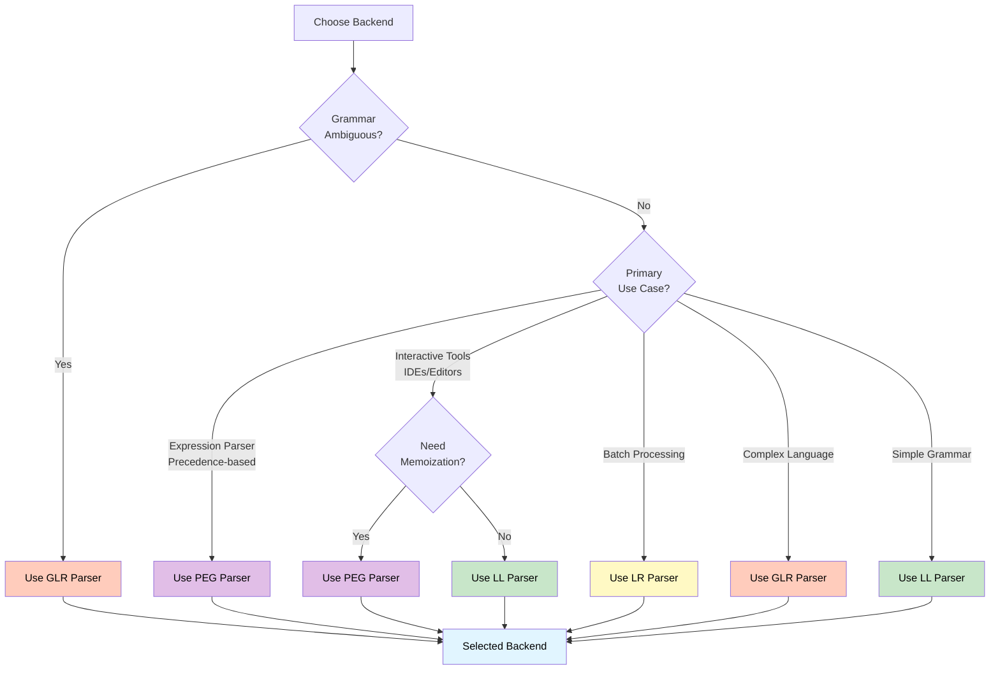

# Choosing a Backend

This guide helps you choose the right parsing backend for your use case.

## Quick Comparison

| Feature | LL(k) | LR | GLR | PEG |
|---------|-------|----|-----|-----|
| Grammar compatibility | LL(k) | LR | Any | Most |
| Ambiguity handling | No | No | Yes | No (ordered choice) |
| Left recursion | With elimination | Yes | Yes | Yes |
| Error recovery | Good | Excellent | Good | Good |
| Incremental parsing | Yes | Yes | Yes | Yes |
| Performance | Fast | Fast | Slower (ambiguous) | Fast (with memo) |
| Memory usage | Small | Medium | Medium | Medium (with memo) |
| Complexity | Low | Medium | High | Medium |

## Decision Tree



### Step-by-Step Decision Process

### 1. Is your grammar ambiguous?

- **Yes** → Use **GLR**
- **No** → Continue to step 2

### 2. What's your primary use case?

- **Expression parser / Precedence-based** → Use **PEG** (natural ordered choice)
- **Interactive tools (IDEs, editors)** → Continue to step 3
- **Batch parsing** → Use **LR** (efficient, good error recovery)
- **Complex language (C++, etc.)** → Use **GLR** (handles ambiguities)
- **Simple grammar** → Use **LL(k)** (simplest)

### 3. For Interactive Tools: Need memoization?

- **Yes** → Use **PEG** (memoization provides fast re-parsing)
- **No** → Use **LL(k)** (simpler, table-based)

## Detailed Scenarios

### Scenario 1: Simple Expression Parser

**Grammar**: Arithmetic expressions with precedence (e.g., `1 + 2 * 3`)

**Recommendation**: **PEG** or **LL(k)** with left-recursion elimination

**Reasoning**:
- Grammar is unambiguous
- **PEG's ordered choice makes precedence natural** - lower precedence operators tried first
- Left recursion can be eliminated (LL) or handled (PEG)
- Simple and fast
- Good for interactive tools

**PEG Grammar Example**:
```rust,ignore
// Precedence: + < * < ( )
// Lower precedence tried first in PEG
Expr -> Expr + Term | Term      // + tried first (lower precedence)
Term -> Term * Factor | Factor  // * tried later (higher precedence)
Factor -> ( Expr ) | Number     // () tried last (highest precedence)
```

**Why PEG works well**: The ordering naturally expresses precedence without needing precedence tables.

### Scenario 2: Language Server

**Grammar**: Full programming language

**Recommendation**: **LL(k)**, **LR**, or **PEG**

**Reasoning**:
- Need incremental parsing (all support it)
- LL(k) is simpler for error messages
- LR has better error recovery
- PEG has memoization for fast parsing
- Choose based on grammar characteristics

### Scenario 3: C++ Parser

**Grammar**: C++ with template syntax ambiguities

**Recommendation**: **GLR**

**Reasoning**:
- Grammar has inherent ambiguities
- Need to handle multiple parse trees
- Can disambiguate using precedence/associativity

### Scenario 4: Batch Parser

**Grammar**: Any unambiguous grammar

**Recommendation**: **LR**

**Reasoning**:
- Efficient for batch processing
- Good error recovery
- Handles left recursion naturally

## Performance Considerations

### LL(k)

- **Fast**: O(n) parsing time
- **Small tables**: Efficient memory usage
- **Good for**: Interactive tools, small to medium files

### LR

- **Fast**: O(n) parsing time
- **Medium tables**: Reasonable memory usage
- **Good for**: Batch processing, large files

### GLR

- **Variable**: O(n) to O(n³) depending on ambiguity
- **Medium to large tables**: More memory for forests
- **Good for**: Ambiguous grammars, complex languages

### PEG

- **With memoization**: O(n) parsing time, O(n) space
- **Without memoization**: O(n) to exponential time, O(1) space
- **Medium memory**: Cache size depends on grammar
- **Good for**: Precedence-based languages, interactive tools

## Grammar Compatibility

### LL(k) Compatible

- No left recursion (or can be eliminated)
- No ambiguity (or k > 1)
- Can compute FIRST/FOLLOW sets

### LR Compatible

- No ambiguity
- No shift/reduce conflicts
- No reduce/reduce conflicts

### GLR Compatible

- Any grammar
- Handles all conflicts
- Handles all ambiguities

### PEG Compatible

- **Most grammars**: Very flexible
- **Left recursion**: Detected and handled (may require restructuring)
- **Ordered choice**: Resolves ambiguity automatically
- **Best for**: Precedence-based expressions, structured data, interactive tools

**Writing PEG Grammars**:
- Order alternatives from **most specific to least specific**
- Lower precedence operators should be tried **first**
- Use repetition for lists and sequences
- Consider memoization for performance

**Example - Precedence**:
```rust,ignore
// Correct: Lower precedence first
Expr -> Expr + Term | Term      // + tried first
Term -> Term * Factor | Factor  // * tried later (higher precedence)

// This naturally gives * higher precedence than +
```

## Migration Path

### From LL to LR

If you need better error recovery or left recursion:

1. Update grammar (if needed)
2. Change parser type
3. Update configuration
4. Test thoroughly

### From LR to GLR

If you encounter ambiguities:

1. Keep same grammar
2. Change parser type
3. Add disambiguation logic
4. Handle parse forests

### From LL/LR to PEG

If you want ordered choice semantics or memoization:

1. **Reorder alternatives**: Most specific first, least specific last
2. **Adjust precedence**: Lower precedence operators tried first
3. **Enable memoization**: Set `enable_memoization: true` for performance
4. **Handle left recursion**: Restructure if needed (PEG detects it)
5. Test thoroughly - ordered choice may change parse results

**Example Migration**:
```rust,ignore
// LL/LR: Precedence via grammar structure or tables
// PEG: Precedence via ordering

// Before (LL/LR style - may need precedence hints):
Expr -> Term | Expr + Term
Term -> Factor | Term * Factor

// After (PEG style - ordering expresses precedence):
Expr -> Expr + Term | Term      // + tried first (lower precedence)
Term -> Term * Factor | Factor  // * tried later (higher precedence)
```

## Recommendations by Use Case

### Interactive Tools (IDEs, Editors)

**Primary**: **LL(k)** or **PEG**
**Alternative**: **LR** if grammar requires it

**Reasoning**: 
- Both LL(k) and PEG are fast and support incremental parsing
- **PEG's memoization** can provide significant speedup for repeated parsing
- **PEG's ordered choice** makes precedence natural for expression languages
- **LL(k)** is simpler for straightforward grammars

**PEG Advantages for IDEs**:
- Memoization caches parse results, making re-parsing very fast
- Incremental parsing benefits from cached nodes
- Ordered choice makes grammar writing intuitive

### Batch Processing

**Primary**: **LR**
**Alternative**: **LL(k)** if grammar is simpler

### Complex Languages

**Primary**: **GLR**
**Alternative**: Transform grammar to be unambiguous, or use **PEG** if ambiguity can be resolved by ordering

**PEG for Complex Languages**:
- Use **PEG** if ambiguities can be resolved by ordering alternatives
- Use **GLR** if you need to explore or track multiple parse trees
- **PEG** is deterministic - always produces one parse tree

### Learning/Prototyping

**Primary**: **LL(k)** or **PEG**

**Reasoning**: 
- **LL(k)**: Simplest to understand and use
- **PEG**: Intuitive grammar writing (ordered choice is natural), good for learning parsing concepts

**PEG for Learning**:
- Ordered choice is easy to understand
- Precedence is expressed naturally
- No need for precedence tables or complex grammar analysis

## Next Steps

- Read backend-specific documentation:
  - [LL Parser](ll-parser.md)
  - [LR Parser](lr-parser.md)
  - [GLR Parser](glr-parser.md)
  - [PEG Parser](peg-parser.md)
- Check [Examples](../examples/) for real-world usage

