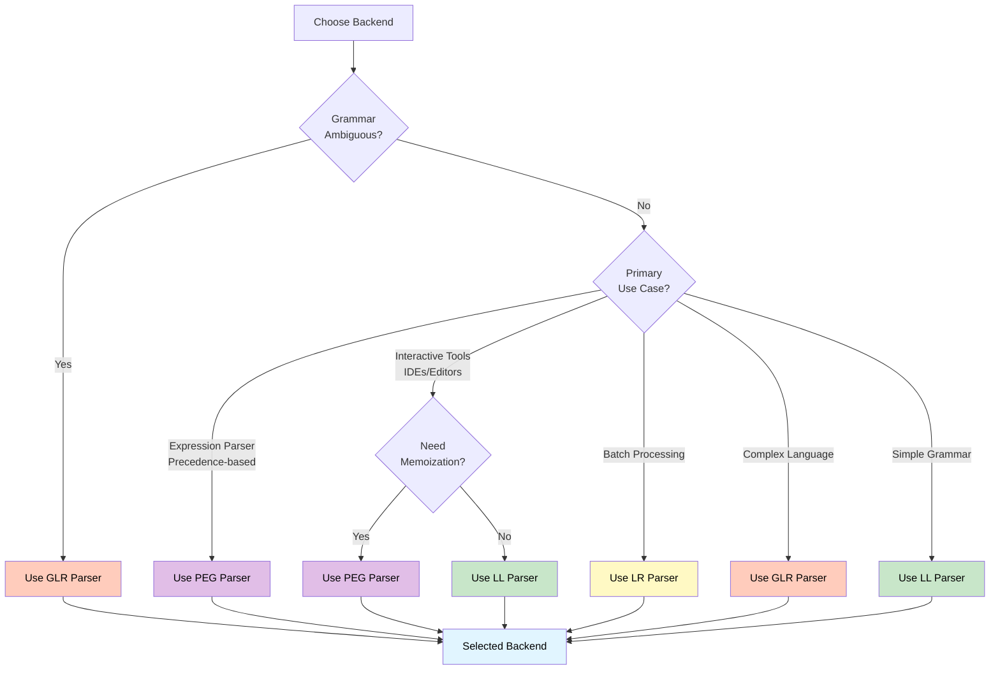

# Parsing Backends Overview

Sipha supports multiple parsing algorithms via feature flags. Each backend has different characteristics and is suited for different use cases.

## Available Backends

### LL(k) Parser (`backend-ll`)

Top-down predictive parsing with configurable lookahead:

- Supports left-recursion elimination
- Configurable error recovery
- Incremental parsing support
- Good for most grammars

### LR Parser (`backend-lr`)

Bottom-up shift-reduce parsing:

- Efficient for many grammar types
- Good error recovery
- Supports LALR and canonical LR
- Table-based parsing

### GLR Parser (`backend-glr`)

Generalized LR parsing for ambiguous grammars:

- Handles non-deterministic and ambiguous grammars
- Parse forest representation for ambiguity tracking
- Configurable disambiguation strategies
- Incremental parsing support
- Ideal for complex languages like C++

### PEG Parser (`backend-peg`)

Parsing Expression Grammar with ordered choice and memoization:

- Ordered choice semantics (first match wins)
- Packrat parsing with memoization for O(n) performance
- Backtracking with configurable depth limits
- Incremental parsing support
- Ideal for precedence-based languages and interactive tools

## ParserBackend Trait

All backends implement the `ParserBackend` trait:

```rust,ignore
pub trait ParserBackend<T, N>: Sized + Send
where
    T: Token,
    N: NonTerminal,
{
    type Config: Default + Clone;
    type Error: std::error::Error + Send + Sync + 'static;
    type State: Send + Sync;

    fn new(grammar: &Grammar<T, N>, config: Self::Config) -> Result<Self, Self::Error>;
    fn parse(&mut self, input: &[T], entry: N) -> ParseResult<T, N>;
    fn parse_incremental(...) -> ParseResult<T, N>;
    fn parse_with_session(...) -> ParseResult<T, N>;
    fn validate(grammar: &Grammar<T, N>) -> Vec<GrammarError<T, N>>;
    fn capabilities() -> BackendCapabilities;
    fn state(&self) -> &Self::State;
}
```

## Backend Capabilities

Each backend reports its capabilities:

```rust,ignore
pub struct BackendCapabilities {
    pub name: &'static str,
    pub algorithm: Algorithm,
    pub supports_left_recursion: bool,
    pub supports_ambiguity: bool,
    pub supports_incremental: bool,
    pub supports_error_recovery: bool,
    pub max_lookahead: Option<usize>,
}
```

## Choosing a Backend



See [Choosing a Backend](choosing.md) for detailed guidance on selecting the right backend for your use case.

## Next Steps

- Learn about [LL Parser](ll-parser.md)
- Explore [LR Parser](lr-parser.md)
- Check out [GLR Parser](glr-parser.md)
- Discover [PEG Parser](peg-parser.md)

## See Also

- [Choosing a Backend](choosing.md) - Detailed guidance on backend selection
- [Cheat Sheet](../reference/cheat-sheet.md) - Quick reference for backend usage
- [Glossary](../reference/glossary.md) - Definitions of parsing-related terms

