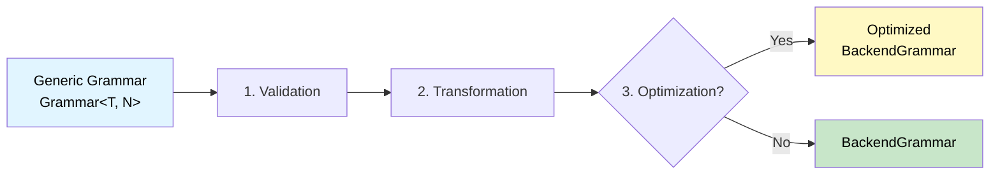

# Grammar Transformation

This chapter explains how Sipha transforms grammars for different parser backends.

## Overview

Sipha uses a **grammar transformation pipeline** to automatically convert your grammar into a format optimized for each parser backend. This allows you to write your grammar once using a unified API, and Sipha handles the backend-specific details.

## The Transformation Pipeline

When you create a parser, Sipha automatically runs your grammar through this pipeline:



### Step 1: Validation

The grammar is validated for compatibility with the chosen backend:

- **Undefined rules**: Check that all referenced non-terminals are defined
- **Backend compatibility**: Verify that the grammar uses features supported by the backend
- **Grammar errors**: Report any structural issues

### Step 2: Transformation

The grammar is transformed from the generic `Grammar<T, N>` format into a backend-specific representation:

- **LL**: `LlGrammar` with parsing tables and FIRST/FOLLOW sets
- **LR**: `LrGrammar` with LR parsing tables (action/goto tables)
- **GLR**: `GlrGrammar` with LR tables and ambiguity handling
- **PEG**: `PegGrammar` with memoization tables
- **Pratt**: `PrattGrammar` with operator precedence tables

During transformation:

- **Extended expressions** are converted to core expressions where possible
- **Unsupported features** are either transformed or rejected with clear error messages
- **Backend-specific optimizations** are applied (e.g., operator extraction for Pratt)

### Step 3: Optimization (Optional)

If optimization is enabled, the transformed grammar is optimized:

- **Table compression**: Reduce parsing table size
- **Common prefix factoring**: Factor out common prefixes in choices
- **Production inlining**: Inline small productions
- **Operator table optimization**: Optimize operator precedence tables (Pratt)

## Backend-Specific Transformations

### LL Parser

**Transformation**:
- Converts `ExtendedExpr` to `CoreExpr` where needed
- Builds LL(k) parsing table
- Computes FIRST and FOLLOW sets
- Handles left-recursion elimination if needed

**Unsupported features**:
- `PrattOperator` (not applicable to LL)
- Some extended expressions may require transformation

### LR Parser

**Transformation**:
- Converts grammar to LR productions
- Builds LR(1) or LALR(1) parsing table
- Computes FIRST and FOLLOW sets
- Handles conflicts (shift/reduce, reduce/reduce)

**Unsupported features**:
- `PrattOperator` (not applicable to LR)
- Some extended expressions may require transformation

### GLR Parser

**Transformation**:
- Similar to LR, but handles conflicts by forking
- Builds parse forest representation
- Supports ambiguity tracking

**Unsupported features**:
- `PrattOperator` (not applicable to GLR)
- Some extended expressions may require transformation

### PEG Parser

**Transformation**:
- Minimal transformation (PEG supports most features natively)
- Sets up memoization tables
- Handles left-recursion detection

**Supported features**:
- Most `ExtendedExpr` features (lookahead, cut, etc.)
- `PrattOperator` is not supported (use PEG's ordered choice instead)

### Pratt Parser

**Transformation**:
- Extracts operator information from `PrattOperator` expressions
- Builds operator precedence table
- Converts expressions to core format where needed

**Supported features**:
- `PrattOperator` (native support)
- Core expressions
- Recovery points

**Unsupported features**:
- Lookahead
- Token classes
- Semantic predicates
- Backreferences

## Expression Transformation

### Core vs Extended Expressions

Sipha uses a two-level expression system:

1. **`CoreExpr`**: Universally supported by all backends
2. **`ExtendedExpr`**: Wraps `CoreExpr` and adds optional features

During transformation, backends:

1. **Check support**: Determine if an extended expression is supported
2. **Transform**: Convert to core expression if possible
3. **Reject**: Return an error if transformation is impossible

### Example: PrattOperator

```rust,ignore
// In your grammar
Expr::pratt_operator(
    Expr::rule(NonTerminal::Term),
    precedence: 10,
    associativity: Associativity::Left
)

// Pratt parser: Extracts operator info, builds precedence table
// Other parsers: Rejected or transformed to core expression
```

## Optimization Levels

### None (Default)

No optimization is performed. The grammar is transformed but not optimized.

### Basic

Basic optimizations are applied:

- **Table compression**: Remove redundant entries
- **Operator table optimization**: Optimize operator precedence tables (Pratt)
- **Memoization cleanup**: Remove stale memo entries (PEG)

### Aggressive

Aggressive optimizations are applied:

- All basic optimizations, plus:
- **Common prefix factoring**: Factor out common prefixes
- **Production inlining**: Inline small productions
- **Expression flattening**: Flatten deeply nested expressions

## Enabling Optimization

Enable optimization via parser configuration:

```rust,ignore
use sipha::backend::traits::OptimizationLevel;

let config = LlConfig {
    optimize: true,
    optimization_level: OptimizationLevel::Basic,
    ..Default::default()
};

let mut parser = LlParser::new(&grammar, config)?;
```

## Transformation Errors

If transformation fails, you'll get a clear error message:

```rust,ignore
match LlParser::new(&grammar, config) {
    Ok(parser) => { /* ... */ }
    Err(e) => {
        eprintln!("Transformation failed: {}", e);
        // Error will indicate which feature is unsupported
    }
}
```

Common transformation errors:

- **Unsupported feature**: A feature used in your grammar isn't supported by the backend
- **Invalid grammar**: The grammar structure is incompatible with the backend
- **Transformation failure**: An internal error during transformation

## Best Practices

1. **Write backend-agnostic grammars**: Use core expressions when possible
2. **Use extended features judiciously**: Check backend support before using extended features
3. **Enable optimization for production**: Use `Basic` or `Aggressive` optimization for better performance
4. **Test with different backends**: Ensure your grammar works with your chosen backend

## Next Steps

- Learn about [Parsing Basics](parsing-basics.md) to understand how parsing works
- Explore [Backend Overview](../backends/overview.md) to see backend-specific details
- Check [Architecture](../architecture/module-structure.md) for implementation details

