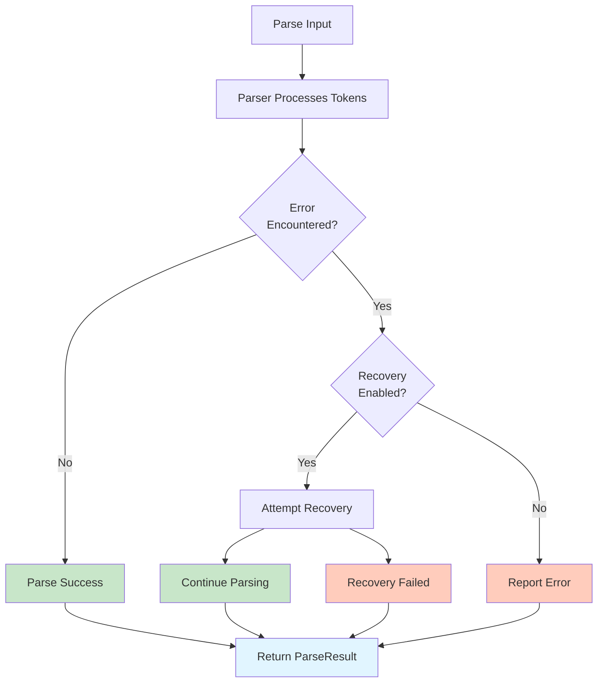

# Error Handling Overview

Sipha provides comprehensive error handling with configurable error recovery strategies. This section covers error types, recovery mechanisms, and best practices for handling errors in your parsers.

## Overview

Sipha's error handling system is designed to:

- **Provide detailed error information** with precise source locations
- **Recover from errors gracefully** to continue parsing
- **Support rich diagnostics** with context and suggestions (via `diagnostics` feature)
- **Distinguish between errors and warnings** for different severity levels

## Error Handling Flow



## Key Concepts

### Errors vs Warnings

- **Errors**: Prevent successful parsing or indicate syntax violations
- **Warnings**: Non-fatal issues that don't prevent parsing

### Error Recovery

Sipha parsers can automatically recover from errors to continue parsing, which is essential for:
- **IDEs**: Providing real-time feedback as users type
- **Language Servers**: Maintaining parse state despite errors
- **Interactive Tools**: Allowing partial parsing results

### Rich Diagnostics

With the `diagnostics` feature enabled, errors include:
- Source code snippets
- Highlighted error locations
- Suggestions and hints
- Related code locations

## What's Covered

This section covers:

- **[Error Types](error-types.md)**: Understanding ParseError, LexerError, and ParseWarning
- **[Working with Errors](working-with-errors.md)**: Checking, reporting, and extracting error information
- **[Error Recovery](recovery.md)**: Configuring and understanding error recovery strategies
- **[Rich Diagnostics](diagnostics.md)**: Using miette for beautiful error reporting
- **[Best Practices](best-practices.md)**: Guidelines and common patterns

## Quick Start

The most basic error handling:

```rust
use sipha::backend::ll::{LlParser, LlConfig};
use sipha::backend::ParserBackend;

let result = parser.parse(&tokens, entry_point);

// Always check for errors
if !result.errors.is_empty() {
    for error in &result.errors {
        eprintln!("Error: {}", error);
    }
    return Err("Parsing failed".into());
}

// Check for warnings
for warning in &result.warnings {
    eprintln!("Warning: {}", warning.message);
}
```

## Next Steps

- Learn about [Error Types](error-types.md) to understand what errors you might encounter
- See [Working with Errors](working-with-errors.md) for practical error handling patterns
- Explore [Error Recovery](recovery.md) to configure recovery strategies

