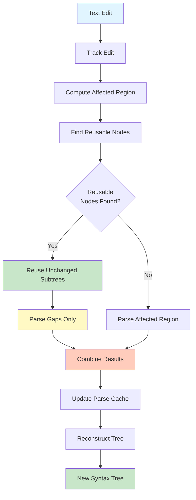

# How Incremental Parsing Works

This chapter explains the internal mechanisms of incremental parsing in Sipha.

## Overview

Incremental parsing works by:

1. **Tracking edits**: Identifying which parts of the text changed
2. **Computing affected regions**: Determining minimal regions to re-parse
3. **Finding reusable nodes**: Identifying unchanged subtrees from previous parse
4. **Re-parsing selectively**: Only parsing affected regions
5. **Reconstructing the tree**: Combining reused nodes with new parse results

### Incremental Parsing Flow



## Edit Tracking

When text is edited, Sipha tracks the changes using `TextEdit`:

```rust
use sipha::incremental::TextEdit;
use sipha::syntax::{TextRange, TextSize};

let edit = TextEdit::replace(
    TextRange::new(TextSize::from(10), TextSize::from(20)),
    "new text".into(),
);
```

Edits can be:
- **Replacements**: Replace a range with new text
- **Insertions**: Insert text at a position
- **Deletions**: Delete a range

## Affected Region Computation

Sipha computes the minimal region that needs to be re-parsed:

```rust
let affected = AffectedRegion::from_edits(&edits, Some(total_len));
```

The affected region:
- **Union**: The smallest range covering all edits
- **Expanded**: The union plus padding for context (default 16 characters)

The expansion ensures that context-dependent parsing (like operator precedence) works correctly.

## Node Reuse

Sipha identifies nodes from the previous parse that can be reused:

```rust
let reusable = find_reusable_nodes(old_tree, affected.expanded(), budget);
```

A node is reusable if:
- It doesn't intersect with the affected region
- It matches the expected syntax kind (if specified)
- It's within the reuse budget

### Reuse Budget

The reuse budget limits how many nodes to consider for reuse:

```rust
use sipha::incremental::ReuseBudget;

// Fixed budget
let budget = ReuseBudget::Fixed(1000);

// Heuristic budget (default)
let budget = ReuseBudget::Heuristic {
    max_depth: 20,
    max_nodes: 1000,
};
```

The heuristic budget considers:
- **Tree depth**: Deeper trees allow more candidates
- **File size**: Larger files allow more candidates
- **Affected region size**: Smaller affected regions allow more candidates

## Incremental Session

An `IncrementalSession` captures everything needed for incremental parsing:

```rust
use sipha::incremental::IncrementalSession;

let session = IncrementalSession::new(old_tree, &edits);
```

The session provides:
- **Old tree**: Previous parse tree
- **Edits**: Text changes
- **Affected region**: Computed affected range
- **Reusable nodes**: List of nodes that can be reused
- **Cache access**: Optional persistent parse cache

## Parse Cache

Sipha maintains a persistent parse cache for cross-session node reuse:

```rust
let session = IncrementalSession::with_cache(old_tree, &edits, &cache);
```

The cache:
- **Keys**: Rule name, start position, version
- **Values**: Cached parse nodes
- **Versioning**: Invalidates old entries based on version
- **Eviction**: Removes old versions automatically

Cache population happens automatically when using `parse_incremental` with a grammar:

```rust
let result = parser.parse_incremental(
    &tokens,
    old_tree,
    &edits,
    entry_point,
    Some(&grammar), // Cache is populated automatically
);
```

## Re-parsing Process

When re-parsing incrementally:

1. **Find reusable nodes**: Query the session for reusable nodes at each position
2. **Parse gaps**: Re-parse only the regions not covered by reusable nodes
3. **Combine results**: Merge reused nodes with newly parsed nodes
4. **Update cache**: Store new parse results in the cache

## Tree Reconstruction

The final tree is reconstructed by:

1. **Starting from root**: Begin with the old tree root
2. **Replacing affected subtrees**: Replace subtrees in affected regions
3. **Inserting new nodes**: Add newly parsed nodes
4. **Preserving structure**: Maintain tree structure outside affected regions

## Performance Characteristics

Incremental parsing performance depends on:

- **Edit size**: Smaller edits = better performance
- **Tree structure**: Deeper trees = more reuse opportunities
- **Cache hit rate**: Higher hit rate = better performance
- **Affected region size**: Smaller regions = faster re-parsing

Typical performance improvements:
- **Small edits** (1-10 characters): 10-100x faster
- **Medium edits** (10-100 characters): 5-20x faster
- **Large edits** (100+ characters): 2-5x faster

## Limitations

Incremental parsing has some limitations:

- **Context sensitivity**: Some parsing decisions depend on distant context
- **Error recovery**: Error recovery may require re-parsing larger regions
- **Ambiguity**: Ambiguous grammars may require full re-parse
- **Cache overhead**: Cache management has some overhead

## Next Steps

- See [Usage](usage.md) for API examples
- Read [Implementation Details](implementation.md) for advanced topics

