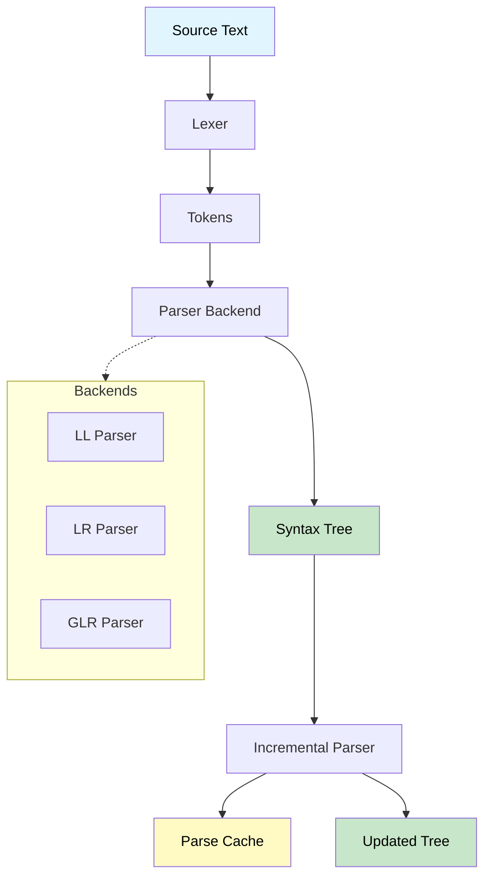

# Introduction

## What is Sipha?

Sipha is a flexible, incremental parsing library for Rust with support for multiple parsing algorithms. Sipha is designed from the ground up to support **incremental parsing**—the ability to efficiently re-parse only the changed portions of your code, making it ideal for interactive applications like IDEs, editors, and language servers.

Unlike traditional parsers that re-parse entire files on every change, Sipha can:

- **Reuse unchanged subtrees** from previous parses
- **Reparse only affected regions** instead of the entire file
- **Maintain parse caches** for efficient updates
- **Dramatically improve performance** in interactive editing scenarios

### Architecture Overview

## Project Status

> [!NOTE]
> Sipha 0.5.0 provides a stable foundation for incremental parsing. The core API is stable, and we continue to add features and improvements based on user feedback. We welcome contributions!

## Key Features

> [!NOTE]
> For a detailed feature comparison with other parsing libraries, see the [README](https://github.com/sipha-parser/sipha/blob/trunk/README.md) in the repository.

Sipha provides a comprehensive parsing solution with these key capabilities:

### Incremental Parsing (Primary Focus)

Sipha's standout feature is its **incremental parsing** capability. When you edit code, Sipha can:

- **Reuse unchanged subtrees** from previous parses
- **Reparse only affected regions** instead of the entire file
- **Maintain parse caches** for efficient updates
- **Dramatically improve performance** in interactive editing scenarios

This makes Sipha perfect for building language servers, IDEs, and other tools that need to parse code as users type.

Learn more in the [Incremental Parsing](incremental-parsing/overview.md) section.

### Additional Features

- **Multiple parsing backends**: Choose from LL(k), LR, and GLR (via feature flags) - see [Parsing Backends](backends/overview.md)
- **Immutable syntax trees**: Green/red tree representation for efficient manipulation - see [Syntax Trees](syntax-trees/green-red-trees.md)
- **Error recovery**: Configurable error recovery strategies for robust parsing - see [Error Handling](error-handling/overview.md)
- **Flexible grammar definition**: Builder API for defining your grammar - see [Grammars](core-concepts/grammars.md)
- **Unicode support**: Full Unicode support for identifiers and text (optional)
- **Rich diagnostics**: Beautiful error messages with miette integration (optional)
- **Tree traversal**: Visitor patterns and query APIs for working with syntax trees

## Use Cases

Sipha is particularly well-suited for:

- **Language Servers**: Building LSP implementations that need fast, incremental parsing
- **IDEs and Editors**: Providing real-time syntax analysis and error checking
- **Code Analysis Tools**: Tools that need to parse and analyze code efficiently
- **Interactive Development Tools**: Any tool that needs to parse code as users edit it
- **Complex Language Parsing**: Using GLR backend for languages with inherent ambiguities (like C++)

## Comparison with Alternatives

| Feature | Sipha | pest | nom | lalrpop |
|---------|-------|------|-----|--------|
| Incremental parsing | ✅ | ❌ | ❌ | ❌ |
| Multiple backends | ✅ | ❌ | ❌ | ❌ |
| Syntax trees | ✅ | ✅ | ❌ | ✅ |
| Error recovery | ✅ | ✅ | ✅ | ✅ |
| Grammar DSL | ❌ | ✅ | ❌ | ✅ |
| Zero-copy | Partial | ✅ | ✅ | ❌ |

### When to Use Sipha

Use Sipha when:

- Building language servers or IDEs
- Need incremental parsing for interactive editing
- Want flexibility in choosing parsing algorithms
- Need rich syntax tree manipulation
- Parsing ambiguous grammars (use GLR backend)

### When to Consider Alternatives

Consider alternatives when:

- Simple one-off parsers (pest or nom might be simpler)
- Maximum performance for batch parsing (nom might be faster)
- Prefer declarative grammar DSLs (pest or lalrpop)

## What's Next?

Ready to get started? Head to [Getting Started](getting-started.md) to install Sipha and build your first parser!

For a deeper dive into specific topics:

- Learn about [Core Concepts](core-concepts/syntax-kinds.md) to understand Sipha's architecture
- Explore [Incremental Parsing](incremental-parsing/overview.md) to understand Sipha's key feature
- Check out [Examples](examples/basic-arithmetic.md) to see Sipha in action
- Read the [Architecture](architecture/design-principles.md) section to understand design decisions

