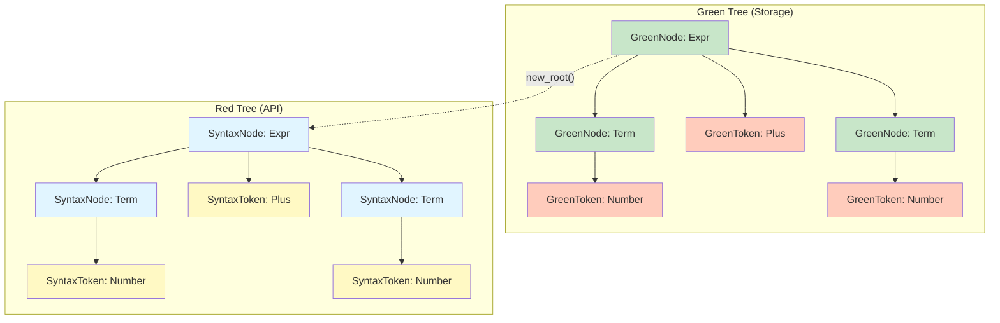

# Green/Red Trees

Sipha uses an immutable green/red tree representation for syntax trees. This design provides efficient memory usage and fast tree operations.

## Overview

The green/red tree architecture separates:

- **Green trees**: Compact, shared representation stored in an arena
- **Red trees**: Convenient API for traversing and querying the tree

This separation provides:

- **Efficient memory usage**: Shared subtrees reduce memory footprint
- **Fast traversal**: Optimized for common tree operations
- **Immutability**: Trees are immutable, enabling safe sharing

## Green Trees

Green trees are the storage layer:

- **Compact**: Minimal memory overhead
- **Shared**: Subtrees can be shared across multiple trees
- **Arena-allocated**: Stored in an arena for efficient allocation
- **Immutable**: Once created, cannot be modified

### GreenNode

A `GreenNode` represents a node in the green tree:

```rust
pub struct GreenNode<K: SyntaxKind> {
    kind: K,
    children: Vec<SyntaxElement<K>>,
    // ... internal fields
}
```

Green nodes contain:
- **Kind**: The syntax kind (terminal or non-terminal)
- **Children**: Child elements (nodes or tokens)
- **Metadata**: Internal metadata for tree operations

## Red Trees

Red trees are the API layer:

- **Convenient**: Easy-to-use API for traversal
- **Lazy**: Created on-demand from green trees
- **Navigable**: Rich navigation API (parent, siblings, etc.)
- **Queryable**: Supports queries and visitors

### SyntaxNode

A `SyntaxNode` represents a node in the red tree:

```rust
let root = SyntaxNode::new_root(green_root.clone());

// Navigate
for child in root.children() {
    println!("{:?}", child.kind());
}

// Find nodes
if let Some(expr) = root.descendants().find(|n| n.kind() == MySyntaxKind::Expr) {
    println!("Found expression");
}
```

## Tree Structure

### Elements

Tree elements can be:

- **Nodes**: Non-terminal nodes (have children)
- **Tokens**: Terminal nodes (leaf nodes)

```rust
pub enum SyntaxElement<K: SyntaxKind> {
    Node(SyntaxNode),
    Token(SyntaxToken),
}
```

### Hierarchy

Trees form a hierarchy:

```
Root (NonTerminal)
├── Child1 (NonTerminal)
│   ├── Token1 (Terminal)
│   └── Token2 (Terminal)
└── Child2 (NonTerminal)
    └── Token3 (Terminal)
```

### Tree Structure Visualization



## Memory Efficiency

Green/red trees are memory-efficient:

1. **Sharing**: Unchanged subtrees are shared across edits
2. **Arena allocation**: Nodes are allocated in an arena
3. **Compact representation**: Minimal overhead per node
4. **Incremental updates**: Only changed regions are recreated

## Design Rationale

The green/red tree design is inspired by:

- **rust-analyzer**: Uses similar architecture
- **rowan**: Provides the green/red tree foundation
- **IDE requirements**: Optimized for interactive editing

Benefits:

- **Fast incremental parsing**: Reuse green nodes
- **Efficient memory**: Share unchanged subtrees
- **Safe sharing**: Immutability enables safe sharing
- **Rich API**: Red trees provide convenient navigation

## Conversion

Convert between green and red trees:

```rust
// Green to Red
let red_root = SyntaxNode::new_root(green_node.clone());

// Red to Green
let green_node = red_node.green();
```

## Next Steps

- Learn [Working with Trees](working-with-trees.md) for traversal and queries
- See [Tree Manipulation](manipulation.md) for building and modifying trees

## See Also

- [Incremental Parsing](../incremental-parsing/overview.md) - How green/red trees enable incremental parsing
- [Glossary](../reference/glossary.md) - Definitions of tree-related terms
- [Architecture](../architecture/data-structures.md) - Deep dive into data structures

