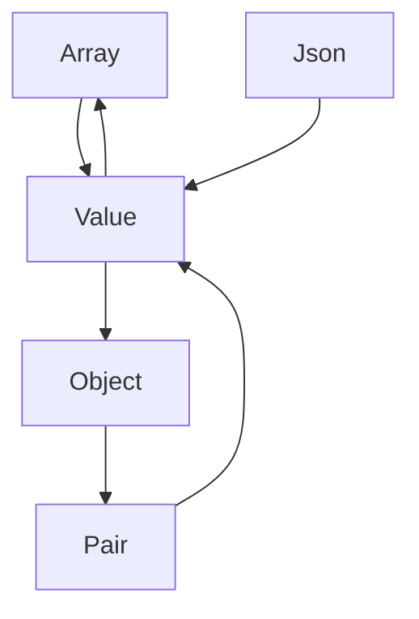

# Grammar Documentation

## Table of Contents

- [Entry Point](#entry-point)
- [Statistics](#statistics)
- [Production Rules](#production-rules)
- [Rule Dependencies](#rule-dependencies)
- [Rule Dependency Graph](#rule-dependency-graph)
- [Tokens](#tokens)
- [Token Usage](#token-usage)
- [Grammar Design Notes](#grammar-design-notes)

## Entry Point

The grammar entry point is [`Json`](#json).

## Statistics

| Metric | Value | Notes |
|--------|-------|-------|
| **Total Rules** | 5 | Array, Json, Object, Pair, Value |
| **Unique Tokens** | 11 | See [Token Reference](#tokens) |
| **Recursive Rules** | 4 | 0 direct, 4 indirect |
| **Nullable Rules** | 0 | None |
| **Recursive Rule Names** | 4 | `Object`, `Value`, `Array`, `Pair` |

## Production Rules

### <a id="array"></a>Array

A JSON array is an ordered list of values enclosed in square brackets.

```ebnf
Array ::= 'LBracket' (Value ('Comma' Value)*)? 'RBracket'
```

**References**: [`Value`](#value)

**Expression Details**:
- Delimited expression with error recovery enabled

### <a id="json"></a>Json

A JSON document consists of a single value (object, array, string, number, boolean, or null).

```ebnf
Json ::= Value
```

**References**: [`Value`](#value)

### <a id="object"></a>Object

A JSON object is a collection of key-value pairs enclosed in curly braces.

```ebnf
Object ::= 'LBrace' (Pair ('Comma' Pair)*)? 'RBrace'
```

**References**: [`Pair`](#pair)

**Expression Details**:
- Delimited expression with error recovery enabled

### <a id="pair"></a>Pair

A key-value pair consists of a string key, a colon, and a value.

```ebnf
Pair ::= 'String' 'Colon' Value
```

**References**: [`Value`](#value)

### <a id="value"></a>Value

A JSON value can be an object, array, string, number, boolean (true/false), or null.

```ebnf
Value ::= Object | Array | 'String' | 'Number' | 'True' | 'False' | 'Null'
```

**References**: [`Object`](#object), [`Array`](#array)

## Rule Dependencies

This section shows which rules reference which other rules.

- **`Array`** references: [`Value`](#value)
- **`Json`** references: [`Value`](#value)
- **`Object`** references: [`Pair`](#pair)
- **`Pair`** references: [`Value`](#value)
- **`Value`** references: [`Object`](#object), [`Array`](#array)

## Rule Dependency Graph



**Legend**: Arrows indicate "references" relationship. The graph shows the indirect recursion between rules.

---

## Grammar Design Notes

### Error Recovery
The following rules have **error recovery enabled** for their delimited expressions: `Object`, `Array`.
This means:
- If a syntax error occurs inside a delimited expression, the parser can skip to the closing delimiter
- This allows parsing to continue and report multiple errors in a single pass

### Indirect Recursion
The grammar supports nested structures through indirect recursion:
- `Array` → Array → Value → Array
- `Object` → Object → Pair → Value → Object
- `Pair` → Pair → Value → Object → Pair
This allows arbitrary nesting depth in the grammar.

---

## Tokens

> **Note**: Tokens in the grammar are matched by their *kind* (type), not by their literal text. In practice, tokens with the same kind but different text (e.g., different string values, different numbers) will match the same grammar rules.

| Token | Literal | Description | Usage Context |
|-------|---------|-------------|---------------|
| `Colon` | `:` | Colon, separates key from value in a pair | `Pair` |
| `Comma` | `,` | Comma, separates elements in objects and arrays | `Array`, `Object` |
| `False` | `false` | The boolean value false | `Value` |
| `LBrace` | `{` | Left brace, opens an object | `Object` |
| `LBracket` | `[` | Left bracket, opens an array | `Array` |
| `Null` | `null` | The null value | `Value` |
| `Number` | `123` | A JSON number (integer or floating-point) | `Value` |
| `RBrace` | `}` | Right brace, closes an object | `Object` |
| `RBracket` | `]` | Right bracket, closes an array | `Array` |
| `String` | `"string"` | A JSON string literal, enclosed in double quotes | `Pair`, `Value` |
| `True` | `true` | The boolean value true | `Value` |

## Token Usage

### By Rule:

| Rule | Tokens Used | Required? |
|------|-------------|-----------|
| **`Array`** | `Comma`, `LBracket`, `RBracket` | Required |
| **`Json`** | *(none directly)* | N/A |
| **`Object`** | `Comma`, `LBrace`, `RBrace` | Required |
| **`Pair`** | `Colon`, `String` | Required |
| **`Value`** | `False`, `Null`, `Number`, `String`, `True` | Required |

### By Token:

| Token | Used In Rules | Purpose |
|-------|---------------|---------|
| `Colon` | `Pair` | Colon, separates key from value in a pair |
| `Comma` | `Array`, `Object` | Comma, separates elements in objects and arrays |
| `False` | `Value` | The boolean value false |
| `LBrace` | `Object` | Left brace, opens an object |
| `LBracket` | `Array` | Left bracket, opens an array |
| `Null` | `Value` | The null value |
| `Number` | `Value` | A JSON number (integer or floating-point) |
| `RBrace` | `Object` | Right brace, closes an object |
| `RBracket` | `Array` | Right bracket, closes an array |
| `String` | `Pair`, `Value` | A JSON string literal, enclosed in double quotes |
| `True` | `Value` | The boolean value true |

